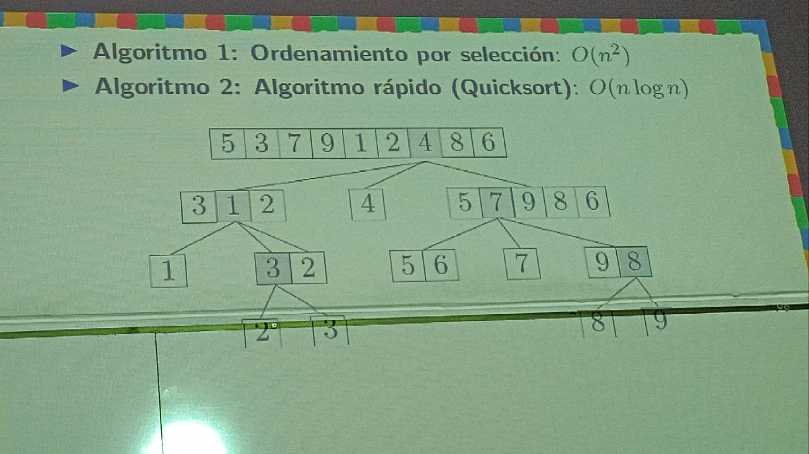
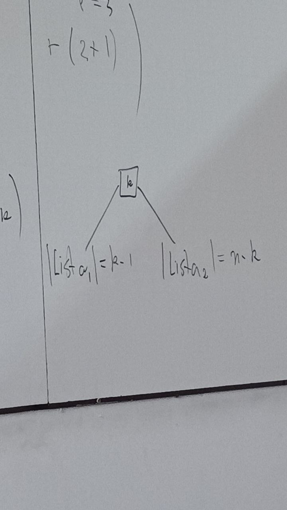
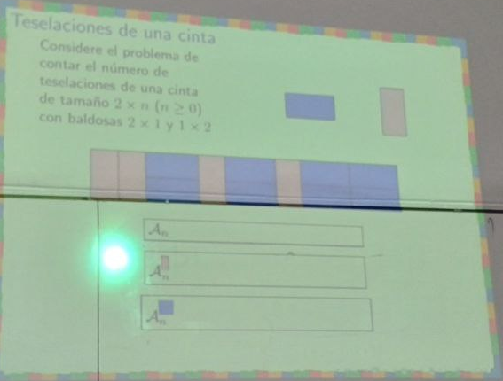

# El arte de contar.

Estudiamo estructuras combinatoria $\mathcal{A}$, que cuente cosas, $\mathcal{A}$ es una estructura discreta. Asi dada una estructura:

$$
\begin{align*}
    \mathcal{A} = \bigcup_{n\geq 0} \mathcal{A}_n
\end{align*}
$$
donde 

$$
\begin{align*}
    \mathcal{A}_n = \{\omega \in \mathcal{A} : \text {peso}(\omega) = n\}
\end{align*}
$$

Sucesion de conteo $a_n = |\mathcal{A}_n|<\infty$, aca podemos tener recurrencias (equivalentes a las ecuaciones difenrenciales), formulas explicitas (se puede probar que nos siempre se van atener formulas explicitas ), identidad combinatoria, identidad asintotica, funcion generatriz.

Analizamos quicksort, asumiendo que todos los elementos son distintos, y se escoge aleatoriamente un pivote, y comparo todos los elementos con el $4$ los mas grandes los mando a la derecha y los menores a la izquierda, y luego aplico el mismo algoritmo a la izquierda y derecha, de forma tal que la raices de un arbol determina el ordenamiento de la lista, siguiendo el preorden del arbol.

## Caso general

$b_n$ el numero promedio de comparaciones llevadas a cabo por quicksort.

Asi para calcular $b_3$ en un orden arbitrario, entonces escogemos el primer elemento tengo que realizar dos comparaciones en primer nivel mas una comparacion en el segundo nivel, para el segundo pivote tenemos que relizar dos comparaciones en el primer nivel mas cero comparaciones en el segundo nivel, y por ultimo para el tercer elemento es lo mismo que el primero, asi:

$$
\begin{align*}
b_3 = \frac{1}3(2+1 + 2 + 2+1) = \frac{8}{3}
\end{align*}
$$
Asi en general:

si $[n] = \{1,2,\dots,n\}$ y ahora:

$$
\begin{align*}
b_n &=\frac{1}n\sum_{k=1}^n( (n-1) + b_{k-1} + b_{n-k}) \text{ con } k = 1,2,\dots,n\\
&= \frac{1}n n(n-1) + \frac{1}n \sum_{k=1}^n b_{k-1} + \frac{1}n \sum_{k=1}^n b_{n-k}\\
&=  (n-1) + \frac{1}n \sum_{k=1}^n(b_{k-1} + b_{n-k})\\
&= (n-1) + \frac{1}n\left(\sum_{k=1}^{n}b_{k-1} + \sum_{k=1}^{n} b_{n-(n-k+1)}\right)\\
&= (n-1) + \frac{1}n\left(\sum_{k=1}^{n}b_{k=1} + b_{k-1}\right)\\
&= (n-1) + \frac{2}n\sum_{k=0}^{n-1}b_k\\
\end{align*}
$$

$b_0 = 0$

Entonces:

$$
\begin{align*}
nb_n = n(n-1) + 2\sum_{k=0}^{n-1}b_k\\
\end{align*}
$$

para todo $n\geq 1$

Asi tomemos:

$$
\begin{align*}
(n+1)b_{n+1} = (n+1)n + 2\sum_{k=0}^{n}b_k\\
\end{align*}
$$

Asi:

$$
\begin{align*}
(n+1)b_{n+1} - nb_n &=  (n+1)n - n(n-1) + 2\sum_{k=0}^{n}b_k - 2\sum_{k=0}^{n-1}b_k\\
&=2n + 2b_n\\
\end{align*}
$$

Despejando:

$$
\begin{align*}
b_{n+1} &= \frac{2n + 2b_n}{n+1}\\
&= \frac{2}{n+1}n + \frac{2}{n+1}b_n\\
\end{align*}
$$

o tambien:

$$
\begin{align*}
(n+1)b_{n+1} - (n+2) b_{n} =2n \quad (*)
\end{align*}
$$
Recurrencia de orden 1 lneal con coeficiencte variables y no homogenea.

### Resolviendo la homogenea:

$$
\begin{align*}
(n+1)a_{n+1} - (n+2)a_n = 0\\
\end{align*}
$$

Luego:

$$
\begin{align*}
a_{n+1} &= \frac{(n+2)}{(n+1)}a_n\\
&= \frac{(n+2)(n+1)}{(n+1)(n)}a_{n-1}\\
&= \frac{(n+2)(n+1)(n)}{(n+1)(n)(n-1)} a_{n-2}\\
\vdots\\
&= (n+2)a_0
\end{align*}
$$

Asi tenemos:

$$
a_{n} = (n+1)a_0
$$

Supongamos que la solucion de la (*) esta dada por:

$$
\begin{align*}
b_n = (n+1)u_n\\
\end{align*}
$$
Sustituyendo en la ecuacion:

$$
\begin{align*}
(n+1)(n+2)u_{n+1} - (n+2)(n+1)u_n &= 2n\\
\end{align*}
$$

Asi:

$$
\begin{align*}
u_{n+1} - u_n &= \frac{2n}{(n+1)(n+2)}\\
\end{align*}
$$

Luego aplicando suma telescopica:

$$
\begin{align*}
\sum_{k=0}^{n-1}(u_{k+1} - u_k) &= \sum_{k=0}^{n-1}\frac{2k}{(k+1)(k+2)}\\
&= u_n - u_0\\
&= \sum_{k=0}^{n-1}\frac{2k}{(k+1)(k+2)}\\
&= 2\sum_{k=0}^{n-1}\left(-\frac{1}{k+1} + \frac{2}{k+2}\right)\\
&= 2\sum_{k=0}^{n-1}\left(\frac{1}{k+2} + \frac{1}{k+2}-\frac{1}{k+1}\right)\\
&= 2\sum_{k=0}^{n-1}\left(\frac{1}{k+2} \right) + 2\left(
    \frac{1}{n+1} - 1\right)\\
&=  2\sum_{k=2}^{n+1}\left(\frac{1}{k} \right) + 2\left(
    \frac{1}{n+1} - 1\right)\\
&= 2 \sum _{k=1}^{n} \left(\frac{1}{k} \right) +2\left(\frac{1}{n+1} -1\right) +2\left(\frac{1}{n+1} -1\right)\\
&= 2H_n+4 \left(
    \frac{1-(n+1)}{n+1}
\right)\\
&= 2H_n - 4 \frac{n}{n+1}
\end{align*}
$$

Recordemos que los numeros armonicos son :

$$
\begin{align*}
H_n = 1+\frac 12 + \frac 13 + \dots + \frac 1n\\
\end{align*}
$$

Pues $u_0 =(1+0) b_0 = 0$

Asim reemplazando en la expresion de $b_n =(n+1)u_n$
$$
\begin{align*}
b_n &= (n+1) u_n\\
&= 2(n+1) - 4n
\end{align*}
$$

Se puede probar que $H_n \sim \log n$ (para la prueba ver calculo de Apostol), Asi:

$$
\begin{align*}
b_n = O(n \log n)
\end{align*}
$$

Revisar lo libro concrete mathematics (D Kanouth, ...), Volumen 1 Artaf prpogramming D, Concrete Tetrahedro, Discrete calculus Springer, Analysis of algorithms,

## Principios basicos de conteo.

### Principio de la suma:

Sea $\{S_i\}_{i=1}^m$ una particion de $\mathcal S$ tal que cada $S_i$ tiene un numero finito de elemntos entonces:

$$
\begin{align*}
|\mathcal S| = \sum_{k=1}^m |S_k|
\end{align*}
$$

### Teselaciones de una cienta 

$$
\begin{align*}
\mathcal A_n &= \mathcal A_{\text{finaliza en baldosa vertical}} + \mathcal A_{\text{finaliza en dos baldosas horizontales}} \\
&\equiv \mathcal A_{n-1} + \mathcal A_{n-2}
\end{align*}
$$

### Contando por complemento

**Ejemplo** : Cual es el numero de palabras ternarias de longuitud 10 con al menus un cero?

$$
\begin{align*}
    \mathcal A_n^c = \mathcal U - \mathcal A_m
\end{align*}
$$

$$
\begin{align*}
a_n^c = u_n -a_n
\end{align*}
$$

Si las palabra tiene un 0 tenemos 10 posibliidades,

Si la palabra tienen dos 0, 10 combinado 2,

                            10 combiando 3
                            10 combinado 4
                            10 combinado 5
                            10 combinado 6
                            10 combinado 7
                            10 combinado 8
                            10 combinado 9 
                            10 combinado 10

por lo que seria:

$$
N = \sum_{i=1}^{10} \begin{pmatrix}
10\\
i
\end{pmatrix} 2^{10-k} = 3^{10} -2^{10}
$$

Ya me di cuenta del error y es que estoy asumiendo que el resto son 1's pero puede ser otros numeros con numero $\{0,1,2\}$ 

$3^10$ todas las combinacion de ternatrias, menos ecomplemento es decir el numero de palabra con ningun cero es decir la palbra binarias

### Principio de multiplicacion 

Sea $\{S_i\}_{i=1}^m$ una familia de conjuntos finitos si $\mathcal S = S_1 \times S_2 \times \dots \times S_m$ entonces:

$$
|\mathcal S| = |S_1| \dots |S_m|
$$

Teorema del principio de multiplicacion 2

Si los elemento de un conjunto S se construyebn mediante elecciones sucesivas 
