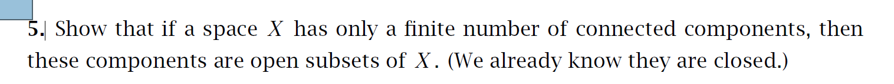

13. Show the two maps $\mathbb{R}^2 \to \mathbb{R}$ sending $(x, y)$ to $x + y$ and $xy$ are continuous, using only definitions and results from this class, not results from calculus for example.

La idea es probar que dado $O \subseteq^{ab} \mathbb R$, entonces $f^{-1}(O)$ es abierto en $\mathbb R^2$. 

Del punto 1 del Hatcher, cualquier conjunto cualquier conjunto abierto es de la forma:

$$
\begin{align*}
O = \bigcup_{x \in O} (a_x,b_x) 
\end{align*}
$$

es suficiente probar que dado $O' = (a_x,b_x)$ para algun $x\in O$. 

Sea $y_1 + y_2 \in O'$ entonces existen $(y_1, y_2) \in f^{-1}(O')$ tal que $f(y_1, y_2) = y_1 + y_2$. Ahora tome $(z_1,z_2) \in \mathbb f^-{1}$ tal que:

$$
\begin{align*}
||(y_1, y_2) - (z_1,z_2)|| < \epsilon
\end{align*}
$$

De esto modo $y_1 + y_2 - \epsilon < z_1 + z_2 < y_1 + y_2 + \epsilon$ para todo los $y

Sea $\{C_i\}_{i=1}^n$ una familia finita de componentes conexas de $X$. Dado $C_i$ is closed para todo $i = 1,2,\dots,n$ y dado que:

$$
\begin{align*}
X = \bigcup_{i=1}^n C_i
\end{align*}
$$

y como ademas la union finita de cerrados es cerrado, Como ademas

$$
\begin{align*}
X/C_j = \bigcup_{i=1, i\neq j}^n C_i
\end{align*}
$$

Cuya union es cerrada, por lo tanto $C_j$ es abierto.
