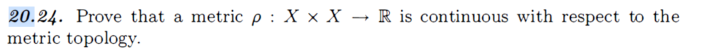

# 20E

Primero veamos que:

$$
\begin{align*}
f: X\times  Y &\to  Y \times X\\
(x,y) &\mapsto (y,x)
\end{align*}
$$

### inyectividad 

Sean $(x_1,y_2),(x_2,y_2) \in X\times Y$ tales que:

$$
\begin{align*}
f(x_1,y_1) &= f(x_2,y_2)\\
(y_1,x_1) &= (y_2,x_2)\\
y_1 &= y_2\\
x_1 &= x_2
\end{align*}
$$

Por lo tanto $(x_1,y_1) = (x_2,y_2)$ y $f$ es inyectiva.

### sobreyectividad

Sea $(y,x) \in Y\times X$. Entonces existe $(x,y) \in X\times Y$ tal que:
$$
\begin{align*}
f(x,y) &= (y,x)\\
\end{align*}
$$

### Continuidad

Sea $\mathcal V\overset{\text{ab}}{\subseteq} Y \times X$, entonces:

$$
\begin{align*}
\mathcal V &= \bigcup_{i\in I} V_i \times U_i \quad V_i \overset{\text{ab}}{\subseteq} Y \quad U_i \overset{\text{ab}}{\subseteq} X\\
\end{align*}
$$

Por lo tanto:
$$
\begin{align*}
f^{-1}(\mathcal V) &= f^{-1}\left(\bigcup_{i\in I} V_i \times U_i\right)\\
&= \bigcup_{i\in I} f^{-1}(V_i \times U_i)\\
&= \bigcup_{i\in I} U_i \times V_i\\
\end{align*}
$$

Puesto que como $V \times U = \{(v,u) \in X\times Y: u \in U, v \in V\}$, entonces 

$$
\begin{align*}
    f^{-1}(V \times U) &= \{ (u,v) \in Y\times X: f(u,v) = (v,u) \in V\times U\}\\
    &= U \times V\\
\end{align*}
$$

Por lo tanto $f^{-1}(\mathcal V)$ es abierto, puesto que es una unión de abiertos. Por lo tanto $f$ es continua. De forma análoga se puede demostrar que $f^{-1}$ definida como:

$$
\begin{align*}
f^{-1}: Y\times X &\to  X\times Y\\
(y,x) &\mapsto (x,y)
\end{align*}
$$

Claramente:

$$
\begin{align*}
f^{-1}(f(x,y)) &= f^{-1}(y,x)\\
&= (x,y)\\
f(f^{-1}(y,x)) &= f(x,y)\\
&= (y,x)\\
\end{align*}
$$

# 20.24

Sea $A \overset{\text{ab}}{\subseteq} \mathbb R$. Queremos ver que $\rho^{-1}(A)$ es abierto. Como $A$ es abierto, entonces:

$$
\begin{align*}
A &= \bigcup_{i\in I} (a_i,b_i)\\
\end{align*}
$$

Por lo tanto:

$$
\begin{align*}
\rho^{-1}(A) &= \rho^{-1}\left(\bigcup_{i\in I} (a_i,b_i)\right)\\
&= \bigcup_{i\in I} \rho^{-1}((a_i,b_i))\\
&= \bigcup_{i\in I} \left\{(x_1,x_2) \in X \times X: \rho(x_1,x_2) \in (a_i,b_i)\right\}\\
\end{align*}
$$

Vamos que:

$$
\begin{align*}
\{(x_1,x_2) \in X \times X: \rho(x_1,x_2) \in (a_i,b_i)\} &= \{(x_1,x_2) \in X \times X: a_i < \rho(x_1,x_2) < b_i\}\\
\end{align*}
$$

Es abierto.