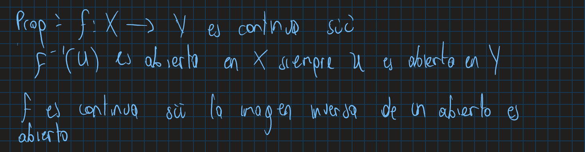
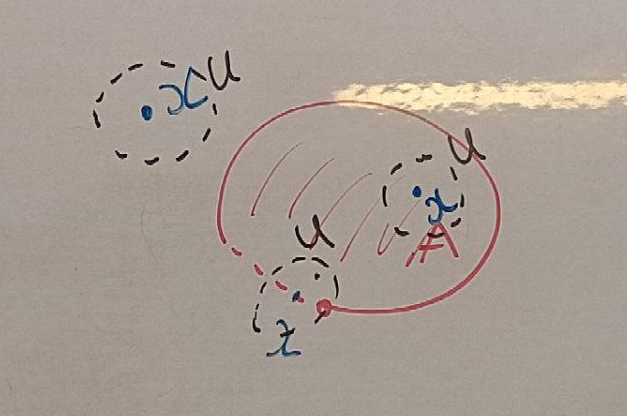
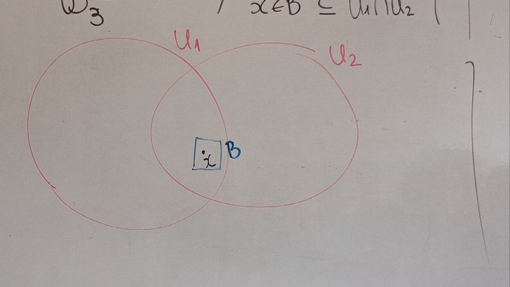

DEfincion:Un espacio topologico es una pareja $(X,\tau)$ donde$ $X$ es un conjunto y $\tau$ es una coleccion de subconjuntos de $X$ que cumplen las siguientes propiedades:

- $\emptyset \in \tau$ y $X \in \tau$.
- La interseccion de cualquier coleccion finita de conjuntos en $\tau$ es un conjunto en $\tau$.
- La union de cualquier coleccion arbitraria de conjuntos en $\tau$ es un conjunto en $\tau$.

Def $f: (X,\tau) \to (Y,\tau_2)$ es continua si (definicion de continua esta en clase 1)

En $\mathbb R$ podemos definir las siguientes topologias

- Topologia usual $\tau_u$:
- $\tau_d = \mathcal P(\mathbb R)$ topologia discreta.
- $t_t$: topologia trivial $\tau_t = \{\emptyset, \mathbb R\}$
- $t_z = \{A \subseteq \mathbb R: R-A \text{ es finito} \}$ topologia Zariski. t
- $t_{couter} = \{A \subseteq \mathbb R: R-A \text{ es numerable} \}$ topologia co- numerable.
- $t_{ca} = \{A \subseteq \mathbb R: \forall x \in A, \exists a,b : x\in [a,b) \in U\}$

dada $id: (\mathbb R_1,\tau_1) \to (\mathbb R_2,\tau_2)$ es continua?

$id(0,1) = (0,1) \notin \tau_t$

Luego id no es continua.

obs: Dado un conjunto $X$ y $\tau_1$ y $\tau_2$ topologias en $X$

$$
id: (X,\tau_1) \to (X,\tau_2) \text{ es continua } \iff \tau_1 \subseteq \tau_2
$$

Notacion: Si $\tau_1 \subseteq \tau_2$ se duce qye $\tau_1$ es mas fina que $\tau_2$ o tambien que $\tau_2$ es mas gruesa que $\tau_1$.

definicion: Dao $X$ un epacio topoologico $A\subset X$ se dice cerrado si $X-A$ es abierto.

**Observacion:** Una topologia tambien se puede definir diciendo que conjunto seran cerrados, por ejemplo la topologia de Zariski se puede definir diciendo que la familia de subcojuntos cerrados es la familia:

$$
\{A \subseteq X: A \text{ es finito} \} \cup \{X\}
$$

**Def**: Sea $A\subseteq X$  (un espacio topologico) $x\in X$ 

Tenemos tres posibilidades excluyentes"

-(a) que existe un $U$ vecindad de $x$ tal que tq $U\cap A = \emptyset$ (x no pertenece a $A$)(x es un punto exterior de $A$)
- (b) que existe un $U$ vecindad de $x$ tal que tq $U\subseteq A$ (x pertenece a $A$)
- (c) Para cada vecindad $U$ de $x$:
$U\cap A \neq \emptyset$ y $U\cap (X-A) \neq \emptyset$ (x pertenece a la frontera de $A$)

Los puntos limites $A$ son los puntos de $X$ que satisfacen la propiedad (c) o (b).

Notacion: 

$Int(A) = \{ x \in X: x \text{ es interior de } A\}$

$\partial A = \{ x \in X: x \text{ es frontera de } A\}$

$\bar A = \{ x \in X: x \text{ es limite de } A\} = Int(A) \cup \partial A$

Tenemos que:

$$
X = Int(A) \cup \partial A \cup Int(X-A)
$$
pues todo punto exterior de $A$ es interior de $X-A$ y no puede ser limite de $A$ y viceversa.

------

## En la topologia usual de $\mathbb R$:(si no se dice nada es la usal)

$\overline{(a,b)} = [a,b]$

$Int(a,b) = (a,b)$

$\partial (a,b) = \{a,b\}$

$\bar{\mathbb Q} = \mathbb R$

$\partial \mathbb Q = \mathbb R$ Todo abierto de $\mathbb R$ contiene racionales e irracionales.

$Int(\mathbb Q) = \emptyset$

**Prop** Dado $A\subseteq X$(X un espacio topologico) se satisface:

$Int(A)$ es abierto

$\bar A$ es cerrado

$A$ es abierto de $X \iff A = Int(A)$

$A$ es cerrado de $X \iff A = \bar A$

**Demostracion**:

### (a) Sea $x \in Int(A)$, existe $U_x$ vecindad de $x$ tal que $x \in U_x \subseteq A$.

$$
Int(A) = \bigcup_{x \in Int(A)} U_x
$$

$\subseteq$ es claro. 

$\supseteq$) Asi debemos ver que $U_x \subseteq Int(A)$. Por lo que sea $y \in U_x$ luego $U_x$ es vecindad de $y$, por definicion de punto interior $y \in Int(A)$, luego $U_x \subseteq Int(A)$. 

### b) 

Sabemos que $X = Int(A) \cup \partial A \cup Int(X-A)$, en otras palabra: $X= \bar A \cup Int(X-A)$, luego $X - \bar A = Int(X-A)$, por lo parte a) $Int(X-A) \subseteq^{ab} X$. Es decir la $\bar A \subseteq^{cer} X$.

### c) $A$ es abierto de $X \iff A = Int(A)$
$\implies$

$\supseteq)$ Es claro que si $x \in \int(A)$, entonces existe $U_x$ vecindad de $x$ tal que $x \in U_x \subseteq A$, asi $x \in A$.

$\subseteq)$ Sea $x \in A$, entonces $A$ es vecindad de $x$ y por lo tanto $x \in Int(A)$, luego $A \subseteq Int(A)$.

$\Leftarrow)$ O.E.S.M (obvio en si mismo.)

### d) $A$ es cerrado de $X \iff A = \bar A$

$\implies$
$X = \bar A \cup Int(X-A)$, como $A$ es cerrados $X-A \subseteq^{ab} X$, por c) $Int(X-A) = X-A$, asi:

$$
X= \bar A \cup X-A
$$

y

$$
X = A \cup Int(X-A)
$$

Por lo que $A = \bar A$, pues las anteriores uniones son disyuntas.

$\Leftarrow)$
Como $A = \bar A$, entonces $X = A \cup Int(X-A)$, pero por la parte a) $Int(X-A)$ es abierto, asi $A$ tienen como complemento un abierto, por lo tanto $A$ es cerrado.

**Ejercicios**: Hatchet pg 14-15: 2,4,5,6.

Viro Invamov pg 11

2.1,2.3,2.6, 2'12x,2.Mx

## Bases para una topologia

Def: una coleccion $\mathcal B$ de abierto en un espacio topologico $X$ es una basse (para una topologia) si todo abierto de $X$ es una union de elementos de $\mathcal B$.

Ej: 
a) $\mathcal B =\{\{x\}: x \in X\}$ es una base para la topologia discreta.

b) $\mathcal B = \{(a,b): a,b \in \mathbb R\}$ es una base para la topologia usual de $\mathbb R$.

c) $\mathcal B' = \{(a,b): a,b \in \mathbb Q\}$ es una base para la topologia usual de $\mathbb R$.

# Ejercicio:
d) En $\mathbb R^2$ con la topologia usual:
  
$$
\mathcal B_1 = \{\mathcal B_\epsilon : \mathbf x \in \mathbb R^2, \epsilon >0\}
$$

$$
\mathcal B_2 = \{\mathcal B_\epsilon : \mathbf x \in \mathbb R^2, \epsilon >0\}
$$

$$
\mathcal B_3 = \{\mathcal B_\epsilon : \mathbf x \in \mathbb R^2, \epsilon >0\}
$$

----

**Prop**: 
Si $\mathcal B$(una forma de definir una topologia de X) es una familia de subconjuntos de $X$ que satisface que 

1) $\forall x \in X$ existe $B \in \mathcal B$ tal que $x \in B$ 
2) $\forall B_1, B_2 \in B, x \in B_1 \cap B_2$ existe $B_3$ tal que $x \in B_3 \subseteq B_1 \cap B_2$

entonces $\mathcal B$ es una base para la topologia de $X$.

**Dem**:

Definimos una familia $\tau$ de subconjuntos de $X$:

$$\tau_{\mathcal{B}} = \{U\subseteq X: U = \bigcup B'\text{donde $\mathcal B$ es una subfamilia de} \mathcal B\}$$

Hay que mostrar que $\tau_{\mathcal{B}}$ es una topologia en $X$.

1- $\emptyset \in \tau_{\mathcal{B}}$, pues 

$$
\emptyset = \bigcup \emptyset
$$

$\emptyset \subset \mathcal{B}$,luego $\emptyset \in \tau_{\mathcal{B}}$

$X = \bigcup \mathcal B$, 

1) Sea $\{U\}_{i \in I}$ una familia de elementos de $\tau_{\mathcal{B}}$, entonces:
2) 
$$
U_i = \bigcup \mathcal B_i
$$

donde $\mathcal B_i$ es una subfamilia de $\mathcal B$.

Notese que:

$$
\bigcup \mathcal B = \bigcup_{i \in I} \mathcal B_i = \bigcup_{i \in I} U_i
$$ 

3) Sea $U_1, \dots , U_n$ elementos en $\tau_{\mathcal{B}}$, entonces:
$$
U_i = \bigcup \mathcal B_i$$

donde $\mathcal B_i$ es una subfamilia de $\mathcal B$.

$U_1 \cap \dots \cap U_ \in \tau_{\mathcal{B}}$

Veamos que esto que esto es cierto por induccion en $n$:

$n=2$ 

$$
U_1 = \bigcup \mathcal B_1$$

$$
U_2 = \bigcup \mathcal B_2$$

Veamos que $U_1 \cap U_2 \in \tau_{\mathcal{B}}$:

Caso 1: $U_1 \cap U_2 = \emptyset$ ya esta en $\tau_{\mathcal{B}}$

Caso 2: $U_1 \cap U_2 \neq \emptyset$

Sea $x \in U_1 \cap U_2$, luego $x\in U_1$, luego existe $B_1 \in \mathcal B_1$ tal que $x \in B_1$ y $x_2 \in U_2$, luego existe $B_2 \in \mathcal B_2$ tal que $x \in B_2$, luego $x \in B_1 \cap B_2$, por la condicion 2, existe $B_3 \in \mathcal B$ tal que $x \in B_3 \subseteq B_1 \cap B_2$.

Sea $\mathcal B_3 = \{B_3 \in \mathcal B: \exist x \in U_1 \cap U_2 \text{ con } x\in B \subset U_1 \cap U_2 \}$

Veamos que:

$$
\begin{align*}
\bigcup \mathcal B_3 = U_1 \cap U_2 \\
\end{align*}
$$

$\subseteq)$ O.E.S.M

$\supseteq)$ Sea $x \in U_1 \cap U_2$, luego existe $B_3$ tq $x \in B_3 \in \mathcal B_3$, entonces $x \in \bigcup \mathcal B_3$ entonces $x \in U_1 \cap U_2 \subseteq \bigcup \mathcal B_3$ luego $U_1 \cap U_2 \in \tau_{\mathcal{B}}$ y $\tau_{\mathcal{B}}$ es una topologia en $X$.
