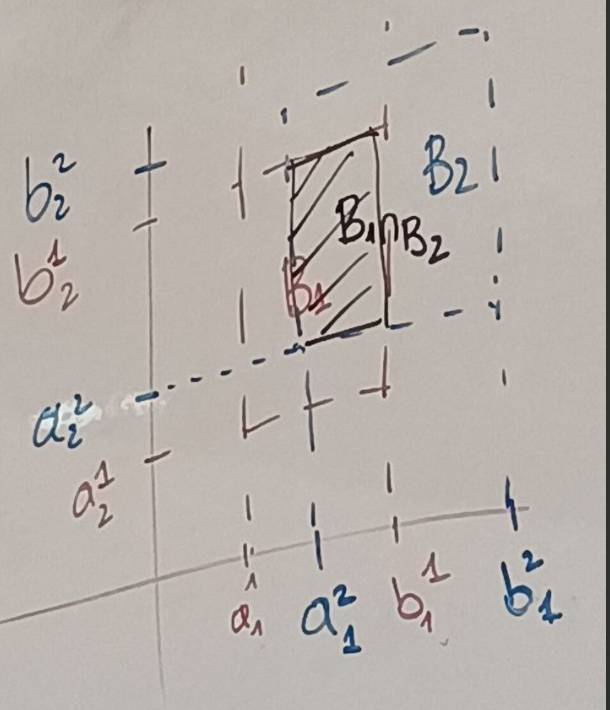

Prop si $\mathcal B$ es una coleccion de subconjuntos de $X$ tal que 

1) $\forall x \in X$ existe $B \in \mathcal B$ tal que $x \in B$
2) $\forall B_1, B_2 \in \mathcal B, x \in B_1 \cap B_2$ existe $B_3$ tal que $x \in B_3 \subseteq B_1 \cap B_2$

Entonces $\mathcal B$ es una base para la topologia de $X$.

## Ejemplo (jueves horario de atencion)

En $\mathbb R^n$ con la topologia usual, la familia
 
 
$$\mathcal B =  \{
    \Pi_{i=1}^n (a_i,b_i) : a_i,b_i \in \mathbb R, i=1,\ldots,n\}$$

Veamos que $\mathcal B$ satisface las condiciones (i) y (ii) de la proposicion:

(1) Sea $x = (x_1, \dots, x_n)$. Sea

$$
\begin{align*}
B = \Pi_{i=1}^n (x_i - 1, x_i + 1) 
\end{align*}
$$

$x \in B$ y $B \in \mathcal B$

(2) Sea 

$$
\begin{align*}
B_1 &= \Pi_{i=1}^n (a_i,b_i)\\
B_2 &= \Pi_{i=1}^n (c_i,d_i)\\
\end{align*}
$$

$x\in B_1 \cap B_2$, de hecho $B \cap B_1 \in \mathcal B$:

$$
\begin{align*}
B_1 \cap B_2= B_3 = \Pi_{i=1}^n(\max\{
    a_i^1, a_i^2\}, \min\{
    b_i^1, b_i^2\})\\
\end{align*}
$$

$\mathcal B$ es una base para alguna topologia en $\mathbb R^n$. Es esta la topologia usual? 
$\tau_u = \tau_{\mathcal{B}}$ 

- $\forall B \in \mathcal B, B \in \tau_u$ (**Ejercicio**)

$$
\begin{align*}
\Pi_{i=1}^n U_i 
\end{align*}
$$
Donde 
$$
\begin{align*}
u_i = \begin{cases}
    \mathbb R & \text{para todos los indices excepto $j$}\\
    (a_j,b_j) & \text{para el indice $j$}
\end{cases}
\end{align*}
$$

$\Pi_{i=1}^n U_i \subseteq^{ab} \mathbb R^n$ y 

$$
\begin{align*}
\Pi_j: \mathbb R^n \to \mathbb R \text{, continua}
\end{align*}
$$

$$
\begin{align*}
\Pi_{i=1}^n U_i^j = \Pi^{-1}_j ((a_i,b_i)) \subseteq^{ab} \mathbb R^n

\end{align*}
$$

ademas 
$$
\begin{align*}
\Pi_{i=1}^n(a_i,b_i) = \cap_{j=1}^n \Pi_{i=1}^n U_i^j \subseteq^{ab} \mathbb R^n
\end{align*}
$$

Ahora tenemos que ver que $\tau_u \subseteq \tau_{\mathcal{B}}$

Bastaria probar que para todo $\epsilon>0$ y para todo $x\in \mathbb R^n$, existe $B \in \mathcal B$ tal que $x \in B$ y $B \subseteq U_\epsilon(x)$, y $B_\epsilon \in \tau_{\mathcal{B}}$

Consideremso 

$$
\begin{align*} 
U = \Pi_{i=1}^n (x_i - \epsilon/n, x_i + \epsilon/n) \in \mathcal B
\end{align*}
$$

es $U\subseteq B_\epsilon(x)$? 

Sea $\mathbf y = (y_1, \dots ,y_n) \in U$

$$
\begin{align*}
y_i \in (x_i - \epsilon, x_i + \epsilon) \implies |y_i - x_i| < \epsilon \quad  \forall i
\end{align*}
$$

luego:

$$
\begin{align*} 
||\mathbf x - \mathbf y|| = \sum_{i=1}^n |x_i - y_i| < \epsilon
\end{align*}
$$

Luego $\mathbf y \in B_\epsilon(x)$, Esto prueba que $\tau_u \subseteq \tau_{\mathcal{B}}$. 

Prop: Si $\mathcal B$ es una base para alguna topologia en $(X,\tau)$, espapcio topologico entonces $\tau_{\mathcal{B}} = \tau$. sii 

- $\tau \subseteq \tau$
- $\forall U \in \tau,\forall x \in U, \exist B \in \mathcal B:  x \in B \subseteq U$ 

El convserso queda como ejercicio.

**Def** (Arreglada) Dado $x \in X$, $X$ esp. topologico. Una vecinddad de $x$ es un conjunto $A \subseteq X$  tq $x\in A$ tq existe un $U\subseteq^{ab} X$ tq $X\in U \subseteq A$ 

(Si $A\subseteq^{ab} X$ decimos que $A$ es vecindad abierta de $x$)

$B_\epsilon(x)$ es una vecindad de $x$, pero no es una vecindad abierta.

**Ejercicio**" $A\subseteq^{ab} X$ sii $A$ es vecindad abierta de todos sus puntos 

## Subespacios

$(X,\tau)$ un espacio topologico y $A\subseteq X$ subconjunto.

Queremos darle a $A$ una topologia que dependa de $\tau$.

Definimos una "topologia" en $A$:

$$
\begin{align*}
U \in \tau_A \iff U = A \cap V \text{ para algun } V \in \tau
\end{align*}
$$

Veamos que $\tau_A$ es topologia"

(i) $\emptyset \in \tau_A$ pues $\emptyset = A \cap \emptyset$ y $\emptyset \in \tau_A$

(ii) $A\in \tau_A$ pues $A = A \cap X$ y $X \in \tau_A$

(iii) Sea $\{U_i\}_{i \in I}$ una familia de elementos de $\tau_A$, entonces:
$$
\begin{align*}
U_i = A \cap V_i \text{ para cada } i \in I
\end{align*}
$$

y

$$
\begin{align*}
\bigcup U_i = \bigcup_{i \in I} (A \cap V_i) = A \cap \bigcup_{i \in I} V_i \in \tau_A
\end{align*}
$$

Luego $\bigcup U_i \in \tau_A$

(iv) (Ejercicio)

**Def** La topologia de $\tau_A$  se llama la topologia de subespacio de $A$ en $X$.

- Si $B\subseteq A$ tq $B \in \tau_A$, decimos que $B [(A-B)] \in \tau_A$  es abierto [es cerrado] en $A$.

**Ejemplo** 
$\overline{B_1}(0)$ es abierto en $\bar B_1(0)$ pero no es abierto en $\mathbb R^n$

Es posible que si $B$ es abierto en $A$ entonces $B$ es abierto en $X$,

**Propiedad** Si $A$ es abierto en $X$ y $B$ es abierto en $A$, entonces $B$ es abierto en $X$.

**Dem**

$\exist V \subseteq^{ab} X$ tq $B = A \cap V$ y $V \in \tau_A$

**Prop** $(X,d)$ un espacio metrico $A\subseteq X$, la topologia de subespacio de $A$ y la topologia inducida por la metrica restringida a $A$ son iguales.

**Dem**

$$
\begin{align*}
\tau_A = \tau_{d|A} ?
\end{align*}
$$

- Por que $\tau_A \subseteq \tau_{d|A}$?

Habria que ver que para todo $\epsilon>0$ y para todo $x\in A$ 

$$
B_\epsilon(x) ^{d|A} = \{
    y \in A: d(x,y) \}= B_{\epsilon}^d(x)  \cap A < \epsilon
\in \tau_A
$$

donde $B_\epsilon(x) = \{y \in X: d(x,y) < \epsilon\}$

Luego por def $B_\epsilon^d(x) \in \tau_A$

- Sea $U \in \tau_{A}$, $x \in U$ (existe $\epsilon>9o$ tq $B_\epsilon(x) \subseteq U$):
$$
\begin{align*}
U = V \cap A
\end{align*}
$$

donde $V \subseteq^{ab} X$ 

Sea $x\in V$ entonces existe $\epsilon>0$ tq $B_\epsilon^d(x) \subseteq V$: 

$$
\begin{align*}
B_\epsilon^{d|A}(x) =  B_\epsilon^d(x) \cap A \subseteq V \cap A = U
\end{align*}
$$

entonces por la proposicion  $\tau_A \subseteq \tau_{d|A}$

De todo lo anterio concluimos que $\tau_A = \tau_{d|A}$

**Def** $A \subseteq X$  (espacio topologico) se dice un subespacio discreto $X$ si $\tau_A$ es la topologia discreta en $A$.

**Ejemplo** 

a) $\mathbb Z$ 

b) $\{
    y_n : n \in \mathbb Z^+
\}$ 

c) $\{
    y_n : n \in \mathbb Z^+
\} \cup \{
    0
\}$

d) $\mathbb Q$

$$
\{n\} = (n-1,n+1) \cap \mathbb Z
$$
 entonces $\{n\} \subseteq^{ab} \mathbb Z$ para todo $n$ tiene la topologia discreta.

$$
\{\frac 1{n+1}\} = (\frac 1{n+2},\frac 1{n+1}) \cap A
$$
con $n\geq 1$ 

$$
\{
    1
\} =  (\frac 12,2) \cap A$$

para todo $(a,b)$ tq $0 \in (a,b)$ existe $n \in \mathbb Z^+$ tq $\frac 1n \in (a,b)$, entonces $\{0\}$ no es abierto en $B$. Entonces $B$ no tienen la topologia discreta,

**Lemma**

Sea $X$ un espacio topologico y $Y\subseteq X$ un subespacion y sea $A\subseteq Y$. La clausura de $A$ en $Y$ es la clausura de $A$ en $X$ interseccionado con $Y$. $x$ es un elemento en la clausura de $A$ en $X$ ?

**Dem**:

Sea $x$ un elemento en la clausura de $A$ en $Y$. Sea $U$ una vecindad abierta de $x$ en $Y$:

$$
\begin{align*}
U \cap A \neq \emptyset
\end{align*}
$$

ademas $U = V \cap Y$,
<!--- con $V$ vecindad abierta de $x$ en $X$, luego 

$$
\begin{align*}
V\cap A 
\end{align*}
$$> -->

Sea $V$ vecindad abierta de $x$ en $X$, $V\cap A \neq = \emptyset$?

$$
\begin{align*}
x\in V\cap A \subseteq^{ab} Y \cap A
\end{align*}
$$

luego $V\cap Y$ es vecindad de $x$ en $Y$

Como $x$ es elemento de la clausura de $A$ en $Y$, entonces:

$$
\begin{align*}
(V\cap Y) \cap A \neq \emptyset
\end{align*}
$$

con $V\cap Y = V\cap A$  \emptyset$ entonces $x$ es un elemento en la clausura de $A$ en $X$.

Para la otra contenencia($x$ un element en la clausura de $A$ en $X\cap Y$)

SEa $U$ una vecindad abierta de $x$ en $Y$, queremos mostrar que $X\cap A \neq \emptyset$

$U = V \cap Y$ con $V$ vecindad abierta de $x$ en $X$. Sabemos que:

$$
\begin{align*}
V \cap A \neq \emptyset
\end{align*}
$$

entonces

$$
\begin{align*}
U\cap A = (V\cap Y) \cap A  = V \cap A \neq \emptyset
\end{align*}
$$

Luego $x$ es un elemento en la clausura de $A$ en $Y$.

**Ejercicio** (Viro Ivanov ed. 2008) pg 17: [3'4], [3'5], 4.A, 4.E, [4'12], [4'16x], [6'3], [6'9], [6'12] sust 2.Mx, [2'13x]

['] conjuntos de ejercicios conducentes a algo.

## Homeomorfismos

funcion biyectica que es continua y al inversa es continua.