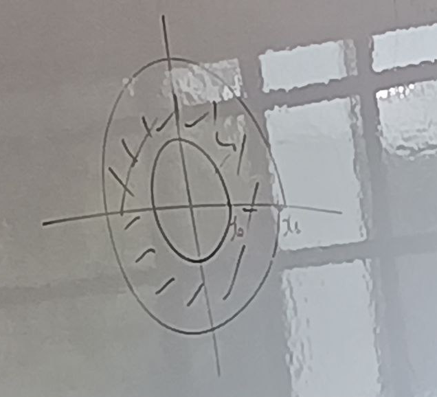

Def: Dados $X$ y $Y$ espacios topologicos, la topologia producto en $X \times Y$  eslaminima topologia que hace  las proyecciones:

$$
\pi_1: X \times Y \to X$$
$$
\pi_2: X \times Y \to Y$$

continua , 

Esto es equivalente a decir que es la topologia generada por la sublase:

$$
\{
 \pi_1^{-1}(U) : U  \subseteq^{ab} X \} \cup \{
    \pi_2^{-1}(V) : V  \subseteq^{ab} Y \}
$$

Esto tambien es equivalente a decir que esla topologia generada pro la base:

$$
\mathcal B = \{ U \times V : U \subseteq^{ab } X, V \subseteq^{ab } Y \}$$

Un disco es abierto, pero no es resultado de producto de abiertos.

**Ejemplo:** $\mathbb R^n - \{0\}$  Es homomeomorfo a $S^{n-1} \times \mathbb R$, es decir la n-1 esfera prodcuto cruz $\mathbb R$.

Se toma la esfera unitaria en $\mathbb R^n$  alrededor del origen, luego tomamos un $\mathbf v$ y luego consideramos su proyeccion a la esfera. Asi definimos 

$$
\begin{align*}
\phi : \mathbb R^n - \{0\} &\to S^{n-1} \times \mathbb R^{+} \sim S^{n-1} \times \mathbb R\\
\mathbf v &\mapsto \left( \frac{\mathbf v}{||\mathbf v||}, ||\mathbf v|| \right)
\end{align*}
$$

y $\phi$ es continua desde el calculo vectorial.

Ahora definamosL:

$$
\begin{align*}
\psi: S^{n-1} \times \mathbb R &\to \mathbb R^n - \{0\}\\
(\mathbf w, \lambda) &\mapsto \lambda \cdot \mathbf w
\end{align*}
$$

y considerando la composicion:

$$
\begin{align*}
(\psi \circ \phi)(\mathbf v) &= \psi \left( \frac{\mathbf v}{||\mathbf v||}, ||\mathbf v|| \right)=\mathbf v
\end{align*}
$$

Ahora sea 

$$
\begin{align*}
(\phi \circ \psi)(\mathbf w, \lambda) &= \phi(\lambda \cdot \mathbf w) = \left( \frac{\lambda \cdot \mathbf w}{||\lambda \cdot \mathbf w||}, ||\lambda \cdot \mathbf w|| \right)\\
&= \left( \frac{\lambda \cdot \mathbf w}{|\lambda| \cdot ||\mathbf w||}, |\lambda| \cdot ||\mathbf w|| \right)\\
&= \left(\mathbf w, \lambda\right)\\
\end{align*}
$$
definimos que $||w|| =1$
Luego $\phi$  es un homomeomorfismo, ademas

Ademas:

$$
\begin{align*}
\mathbb R^+ &\to \mathbb R \quad \text{es un homeomorfismo} \\
x& \mapsto \ln(x)\\
\end{align*}
$$

$$
\begin{align*}
\mathbb R \to \mathbb R^+ \quad \text{es un homeomorfismo} \\
x& \mapsto e^x\\
\end{align*}
$$

Luego $\mathbb R^+ \equiv \mathbb R$. Notemos que 

$$
\begin{align*}
S^{n-1} = \{ \mathbf v \in \mathbb R^n : ||\mathbf v|| = 1 \}
\end{align*}
$$

por eso $||w||$ tiene nomra 1

Tambien definimos
$$
\begin{align*}
(id, \mathcal f) \circ \phi : S^{n-1} \times \mathbb R &\to S^{n-1} \times \mathbb R\\
(\mathbf w, \lambda) &\mapsto (\mathbf w, \ln(\lambda))\\
\end{align*}
$$

define un homomeomorfismo entre $\mathbb R^{n} - \{0\}$ y $S^{n-1} \times \mathbb R$.

Ahora $S^{1} \times[a,b]$ es homeomorfo  a una corona 

Prop: Una $f: Z \to X \times Y$ es continua si y solo si 
$$
\begin{align*}
\Pi_1 \circ f: Z &\to X
\end{align*}
$$

$$
\begin{align*}
\Pi_2 \circ f: Z &\to Y\\
\end{align*}
$$

Son continuas.

**Dem** 

$\implies$ OEMS,

$\impliedby$  (Ejercicio observacion)

Si $\mathcal B$ es una subbase de $Y$ y $f:X\to Y$ es continua sii $f^{-1}(B) \subseteq^{ab} X$, para todo $B \in \mathcal B$.

Sea $\Pi_1^{-1}(U)$ un abierto de la subbase de la top producto ($U\subseteq^{ab} X$), queremos ver que:

$$\begin{align*}
f^{-1}(\Pi_1^{-1}(U)) \subseteq^{ab} Z
\end{align*}
$$
 donde $\Pi_1 \circ f$ 

 Ahora $f^{-1}(\Pi_1^{-1}(U)) =  (\Pi_1 \circ f)^{-1}(U) \subseteq^{ab} Z$ pues $\Pi_1 \circ f$ es continua. Analogamente se muestra que:

 $f^{-1}(\Pi_2^{-1}(V)) \subseteq^{ab} Z$ para todo $V \subseteq^{ab} Y$
]

Ejercicios (Hatcher cap 1).

(12,15). 

Viro, Ivanov, 20E,20.24, 20.31, 20.R, [20'8], 20.Y.

Fin del primer capitulo.

## Conexidad.

Propiedades que nos permitas diferenciar espacios, e identificar propepiedades. que hacen a un espacio mas tratable

Intuitivamente Un espacion es conexo si tiene solo una parte.

**Ejemplos de conexos**
- $\mathbb R^n$ es conexo, 

**No conexos:**

- $\{a,b\}$ en la topologia discreta,
- $(a,b) \cup (c,d)$ en subespacio de $\mathbb R$.

Es $\mathbb R^n-\{0\}$ conexo? En la topologia de subespacio de $\mathbb R^n$?, es conexo,  si $n>=2$. si $n=1$ no es conexo.

### Formalizacion.

**Def** $X$ es conexo si no es posible descomponerlo como la union de dos abiertos no vacios disyuntos, Lo cual significa que

$$
\begin{align*}
X = A \cup B \quad \text{con } A,B \subseteq^{ab} X, A,B \neq \emptyset
\end{align*}
$$
entonces $A \cap B = \emptyset$ 

**Ejemplo**

a) $X = (a,b) \cup (c,d)$, $b<C$ no es convexo por que $(a,b)
\subseteq^{ab} X$ y $(c,d) \subseteq^{ab} X$, y $(a,b) \cap (c,d) = \emptyset$. Es un espacio disconexo o no conexo.

b) (X, \mathcal T_{discreta}) $|X|>1$, $X$ es disconexo, 

Sea $a \in X$, entonces 

$$
\begin{align*}
X = \{a\} \cup (X - \{a\}) \quad \text{con } \{a\}, X - \{a\} \in \mathcal T_{discreta}
\end{align*}
$$

El espacio tiempo es conexo, que ocurre alrededor de eso con el tunelamiento cuantico.

**Teorema** $[a,b]$ es conexo.

**Demonstracion**: Considremos dos casos:

I) $a=b$ entonces $[a,b] = \{a\}$ es conexo. El singleton es siempre conexo. Pues el singleton solo puede tener la topologia discreta.

II) $\emptyset$ es vaciamente conexo.

III)$a<b$  Supongamos que $[a,b] = A \cup B$ union disyunta, con $A,B \subseteq^{ab} [a,b]$, luego $A,B \subseteq^{cerr} [a,b]$. 

Supongamos que $a\in A$, existe un $\epsilon > 0$ tal que $[a,a+\epsilon) \subseteq^{ab} A$, Luego existe $c>a \in [a, a+\epsilon)$ tal que $[a,c] \subseteq A$. Si 

$$
\begin{align*}
C= \{c\in \mathbb R: [a,c] \subseteq A\}
\end{align*}
$$

Si $b\in C$, entonces $B \neq \emptyset$. (una forma alternatica es $X =A \cup B$, $A,B \subseteq^{ab}$, $A\neq \emptyset \implies B =\emptyset$ ).

- $C \neq \emptyset$ por que $a\in C$.
- $C$ es acotado superiormente, por que $b$ es una cota superior de $C$. Si $[a,c] \subseteq A\subseteq [a,b]$, esot es $c\leq d$. Por lo que $C$ tiene  supresmos,  y veamos que $\sup C = b$:
  - $\sup C >a$. Existe $c>a$ tal que $c \in C$, porlo que $a$ no cota superior de $C$.
  - $\sup C \in C$, $[a,\sup C] \subseteq A$, queremos ver que el $\sup C$ es un punto limite de $A$. Sea $U$ vecindad basica del $\sup C$ en $[a,b]$. Tenemos que ocurre uno de los siguientes:
    - $U = (\sup C - \epsilon, \sup C + \epsilon)$.
    - $U = (\sup C - \epsilon, \sup C)$
  - En cualquier caso $(\sup C - \epsilon, \sup C] \subseteq U$. Queremos ver que $U \cap A \neq \emptyset$. Notemos $\sup C - \epsilon/2$ no es cota superior de $C$, exisste $c \in C$ tq $c \sup C - \epsilon/2$, luego $[a,c] \subseteq A$,entonces $c \in A$. Luego $c \in U$, entonces $c \in U \cap A \neq \emptyset$. Luego $c$ es un punto limite de $A$.
  - Como $A$ es cerrado, $A$ contiene todos sus puntos limites, por lo que $\sup C \in A$.
- Sea $c \in [a,\sup C] \subseteq A$, $\sup C \in C$. Consideremos:
$$
\begin{align*}
\bigcup_{c \in C} [a,c] = [a,\sup C) \subseteq A
\end{align*}
$$

- Pero como el $\sup C \in A$ entonces $[a,\sup C] \subseteq A$. Es decir $\sup C \in C$. 
- Supongamos que $\sup C < b$, y $[a, \sup C] \subseteq A$, pero $A$ es abierto entonces $\epsilon > 0$ tal que $[a, \sup C + \epsilon) \subseteq A$, y $[a,\sup C] \subseteq [a,\sup C + \epsilon)$, luego  $\sup C + \epsilon/2 \in C$ luego esto no es posible por la propiedad del supremo.  Entonces $sup C = b$. Es decir $[a,b] \subseteq A$, y entonces $B = \emptyset$, luego $[a,b]$ es conexo.

**Observacion **: Conexidad se preserva  por homeomorfismos.

**Teorema**: Sea $A \subseteq X$ si $A\subseteq B \subseteq \overline A$, si $A$ es conexo, entonces $B$ es conexo.

**Demostracion**: Supongamos que $B$ Se desompone en $B = C \cup D$, donde $C,D$ son abiertos disjuntos no vacios. Intersectando con $A$

$A = (C \cap A) \cup (D \cap A)$, donde $C \cap A$ y $D \cap A$ son abiertos disjuntos de $A$, Entonces o bien $A\subseteq A$ o $A\subseteq D$. Por ejemplo si $A \subseteq C$ entonces $\overline A \subseteq \overline C$, Continuara JAJAJAJ.

