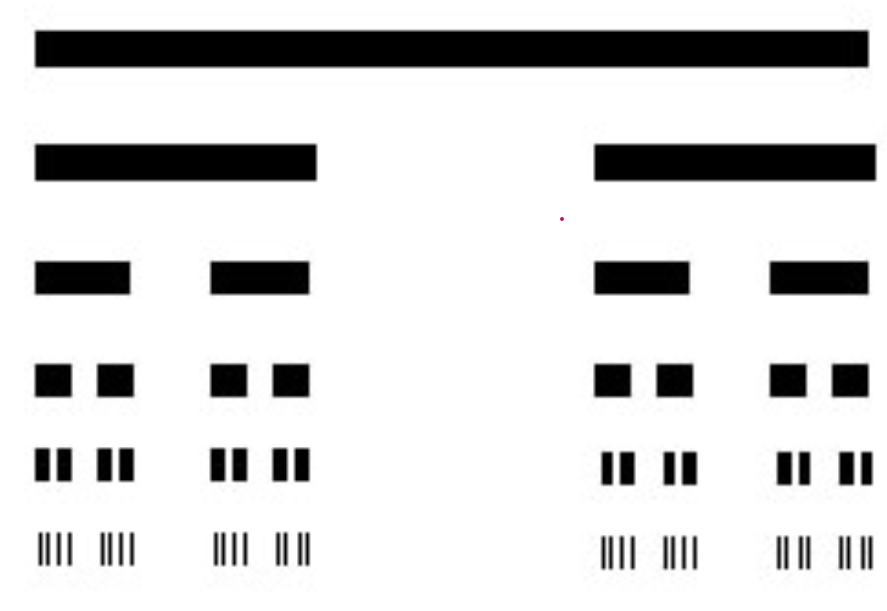

# componentes  conexas y arcoconexas

**Def**:$A \subseteq X$ es una componente conexa (arco conexa), si $A$ es conexo (arcoconexo) y es maximal entre los subejemplos conexos (arcoconexos) de $X$ (Si $\subseteq X$ es conexo y $A \subseteq B \subseteq X$ es conexo, entonces $A = B$).

**Def**: Un espacio $X$ donde todos sus componentes conexas son puntos se llama totalmente disconexo.

**Ejemplos**: 
- $(X, \mathcal T_{\text{discreto}})$ es totalmente disconexo.
- $Q \subseteq \mathbb R$ es totalmente disconexo.

**Dem**: Sea $A\subseteq \mathbb Q$ conexo. Supongamos que $|A| > 1$. Sean $a,b \in A$ con $a\neq b$. $A$ es un intervalo luego $[a,b] \subseteq A$. Luego existe $\xi \in [a,b]$ tal que $\xi \in (\mathbb R \setminus \mathbb Q)$. Entonces $\xi \in \mathbb Q \cap (\mathbb R \setminus \mathbb Q)$ contradiccion.

**Nota**: Arcoconexo implica conexo lo cual en $\mathbb R$ es equivalente ser un intervalo.

**Pregunta**: Existe un subespacio totalmente disconexo de $\mathbb R$ que es cerrado y que no contiene puntos aislados? Si pero no es trivial, uno de ellos es es que llamamo el conjunto de Cantor.

Un punto aislado es aquel que $x  \in A$ existe un entorno $U$ tal que $U \cap A = \{x\}$.

Los discreots y los densos son totalmente disconexos. 

### Cantor 

Definimos una sucesion de conjuntos cerrados $C_n$ de la siguiente manera:

$$
\begin{align*}
C_0 \subseteq C_1 \subseteq C_2 \subseteq \dots \subseteq C_n \subseteq \dots
\end{align*}
$$

$$
\begin{align*}
C_0 &= [0,1]\\
C_1 &= [0,1] \setminus \left(\frac{1}{3},\frac{2}{3}\right)\\
C_2 &=C_1 \setminus \left(\frac{1}{9},\frac{2}{9}\right) \cup \left(\frac{7}{9},\frac{8}{9}\right)\\
\vdots\\
C_n &= C_{n-1} \setminus \bigcup_{i=1}^{3^n -2} \left(\frac{1+3k}{3^{n} },\frac{2+3k}{3^{n}}\right)\\
\end{align*}
$$

$C_n$ se obtiene de $C_{n-1}$ removiendo las terceras partes intermedias de cada intervalo de $C_{n-1}$.

- $C_n$ es cerrado.
- $C_n$ tiene $2^{n}$ componentes conexas de longuitud $\frac{1}{3^n}$.
- $C_n$ es la union de $2^{n}$ intervalos cerrados de longuitud $\frac{1}{3^n}$.

Sea:

$$
\begin{align*}
\mathcal C = \bigcap_{n=0}^{\infty} C_n
\end{align*}
$$

$\mathcal C$ se llama el conjunto de Cantor veamos que tine las siguentes propiedades necesarias;

- $\mathcal C$ es 
- $\mathcal C$  es totalmente disconexo.
Veamos que $\mathcal C$  no contiene ningun intervalo de longitud positiva. 

Sup que existe $\epsilon > 0$ y $x \in \mathcal C$  talque $(x-\epsilon, x+\epsilon) \subseteq \mathcal C$. 

$$
\begin{align*}
(x-\epsilon, x+\epsilon) \subseteq \mathcal C\subseteq C_n \quad \forall n \in \mathbb N
\end{align*}
$$

Solo contiene intervalos de longitud a lo mas $\frac{1}{3^n}$. Luego $\mathcal C$ no contiene intervalos de longitud positiva.luego $\mathcal C$ es totalmente disconexo.

- $\mathcal C$ no contiene puntos aislados:

Sea $x\ in \mathcal C$.

Para todo $n$, $x\in C_n$, pero $C_n$ es union de intervalos cerrados, sea  $I_n$ el intervalo de $C_n$ que contiene a $x$. Si $m>n$ $I_m\subseteq I_n$:

$$
\begin{align*}
diam(I_n) = \frac{1}{3^n} 
% \to 0 \quad \text{cuando } n \to \infty
\end{align*}
$$

y

$$
\begin{align*}
\bigcap_{n=0}^{\infty} I_n = \{x\}
\end{align*}
$$

Sea $\epsilon > 0$, veamos que $(x-\epsilon, x+\epsilon) \cap \mathcal C \neq \{x\}$.  Sea $I_n$ tal que $\frac{1}{3^n} < \epsilon$, luego $I_n \subseteq (x-\epsilon, x+\epsilon)$. Por que los limites de $I_n$ estana una distancia a los mas $\frac{1}{3^n}$ de $x$, luego 

$$
\begin{align*}
|x-a_n| \leq \frac{1}{3^n} < \epsilon \quad \Rightarrow a_n \in (x-\epsilon,x+\epsilon)\\
|x -b_n| \leq \frac{1}{3^n} < \epsilon \quad \Rightarrow b_n \in (x-\epsilon,x+\epsilon)\\
\end{align*}
$$

entonces $a_n \in (x-\epsilon, x+\epsilon)$. 

Luego $I_n \subseteq (x-\epsilon, x+\epsilon)$ Entonces $a_n \in \mathcal C$ por los limites de cualquier intervalo de $C_n$ estan en $\mathcal C$.Luego:

$$
\begin{align*}
a_n \in (x-\epsilon, x+\epsilon) \cap \mathcal C \\
b_n \in (x-\epsilon, x+\epsilon) \cap \mathcal C
\end{align*}
$$

Ejercicio 

Pag 25 - 26, 8,9  (Hatcher)

Viro Ivannov  pg 15

[2'12x]

### Compacidad 

**Def**:$X$ es compacto si dada una familia de abiertos $\{U_i\}_{i \in I}$ tales que:

$$
\begin{align*}
X = \bigcup_{i \in I} U_i
\end{align*}
$$

(Cubrimiento abierto) existe una subfamilia finita $\{U_{i_1}, U_{i_2}, \dots, U_{i_n}\}$ tal que:

$$
\begin{align*}
X = \bigcup_{j=1}^n U_{i_j}
\end{align*}
$$