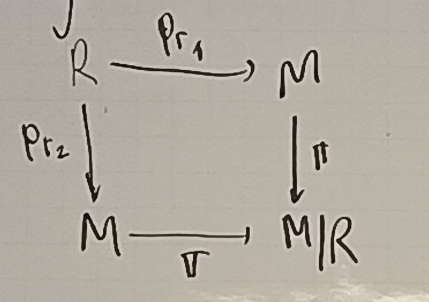
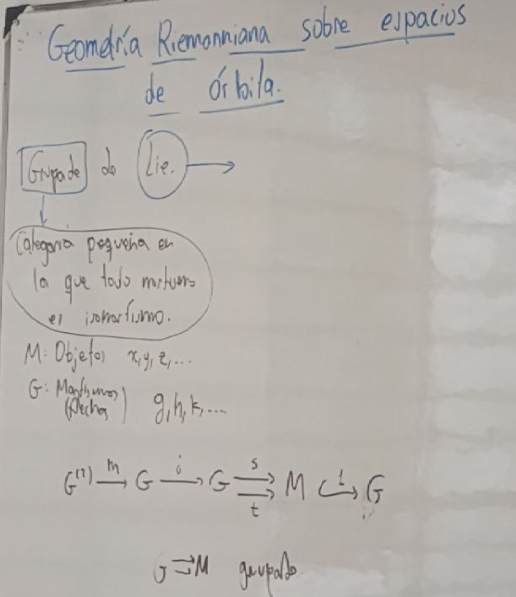
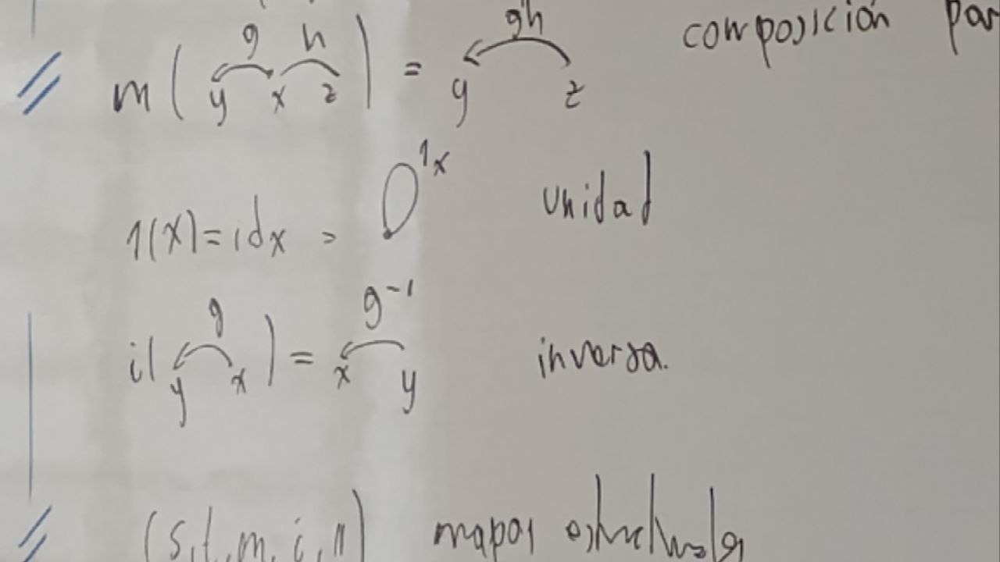
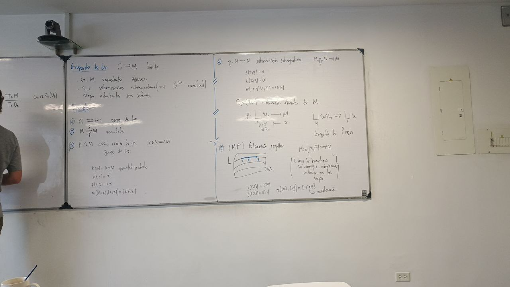
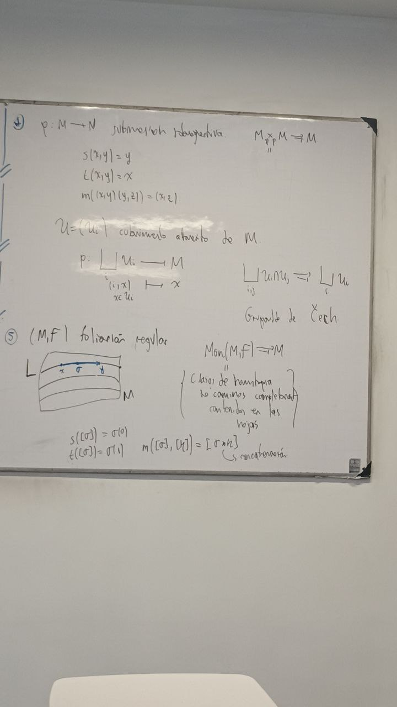
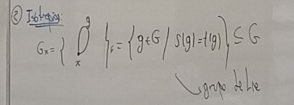
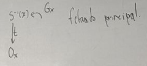
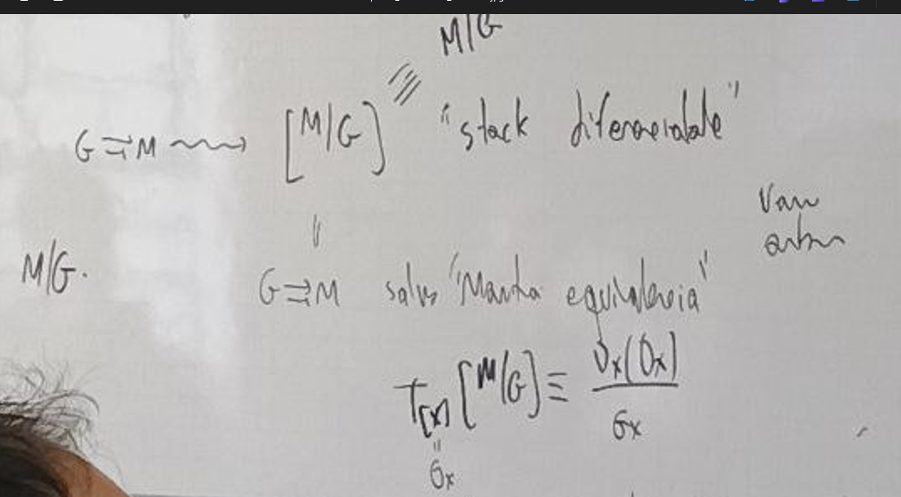
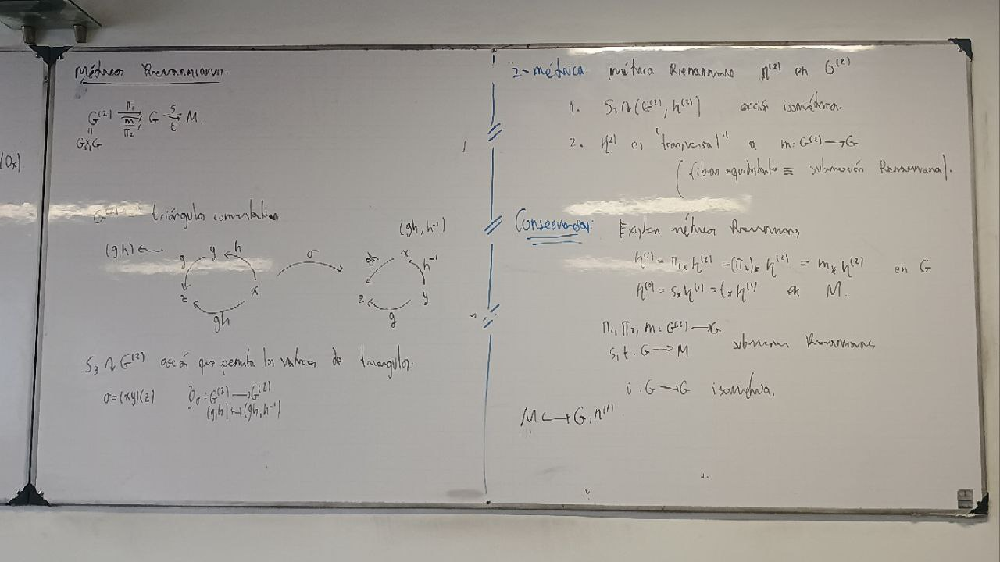

# Geometrica Rimanniana sobre espacios de orbita

$M$ variadad suave.

$$
\begin{align*}
R\subseteq M\times M
\end{align*}
$$

relacion de equivalencia. M/R es uan variadad suave?. Definimos

$$
\begin{align*}
\pi: M &\to M/R\\
\end{align*}
$$
submersion,

1)$S' \cap \mathbb R^2$ con $S' = SO(2)$,

2) $p: \mathbb R^2 /{(0,0)} \to \mathbb R$ tal que $(x,y) \to x$ 

$\mathcal f foliacion de $\mathbb R^2 /{(0,0)}$ por las fibras p

Hausdof noes localmente ecuclidea en O $\mathbb $R^2/{(0,0)}/F$

Localmente euclidea en No Hausdorff.

3) $\mathbb Z_4 \curvearrowright \mathbb R^3$
Ritacionde de $\frac{2\pi}{3}$ repecto al .....

......

$K \curvearrowright M$ ...... y propia

$K$ grupo de .... entonces $M/K$ 

$p: M \to N$ es una submersion sobreyectiva con fibras conexas 
$$
M/\mathcal F \equiv N
$$

En general:

Criterio de go.....

$$R\subseteq M\times M$$ 

subvariedad 

$$
\begin{align*}
p_{r_1}, p_{r_2}: R \to M\\
\end{align*}
$$

submersion (creo). Entonces

$$
\begin{align*}
M/R
\end{align*}
$$ 

variedad y 
$$
\begin{align*}
\pi: M &\to M/R\\
\end{align*}
$$

$$
\begin{align*}
K \curvearrowright M\\
\end{align*}
$$

localmente .... propiea,entonces

$$
\begin{align*}
M/K 
\end{align*}
$$

orbit...

Existe una manera de hacer geometria topologia diferencial sobre $M/R$  si ausmir *?

Ahora se $x\to y$ a traves de g

$$
\begin{align*}
s(g) = x \quad \text{origen}\\
t(g) = y \quad \text{destino}\\
\end{align*}
$$

$$
\begin{align*}
G^{(2)} = G_5 \times_t G = \{g,h \in G\times G: s(g) = t(h)\} = \{
    x-> y ->z, \text{x a y por g y y a z por h}
\}
\end{align*} 
$$

composicion parcial 

se tiene que $x\to y \to z= x\to z$ por compicion parcial gh

1(x) es la identidad un loop unidad

$(s,t,m,u,i)$ mapas orbitales (creo).

### Grupo de Lie 
$$
\begin{align*}
G= M
\end{align*}
$$

- $G,M$ variadad suave.
- $s,t$ son submersiones sobreyectivas. (entonces $G^2$ es una variedad) mapas estructurales son suaves.

**Ejemplo** 
1) 
$$
\begin{align*}
G \to \to \ \braket{*}\\
\end{align*}
$$

 
2)

$$
\begin{align*}
M \to \to M\\
\end{align*}
$$
la dos felictas en esta esta ultima es la identidad

1) $K\curvearrowright M$  accion suave de un grupo de lie. 
$$
\begin{align*}
K \ M \to \to M\\
\end{align*}
$$

**Teorema espectral** 
$$
G \rightrightarrows M
$$

Grupo de lie $x \in M$

1- Orbitas 

$$
\begin{align*}
O_x = \{g \in M: g \text{ de $x$ a $y$}\} \subseteq M\\
\end{align*}
$$
Subvariedad de inmersa 

$F_u$: es la ocmponente ...... de loas oribitas $S*F_M = T*F_m = F_{no se entiende}$

2- isotopias

3- 

4- Representacion normal:

$$
\begin{align*}
D_x(O_x) = \frac{T_x M}{T_x O_x}
\end{align*}
$$

$$
\begin{align*}
G\curvearrowright M D_x(O_x)
\end{align*}
$$

$$
G_x \to GL((D_x(O_x)))
$$

$$
\begin{align*}
g[u] = [dt(g)(w)]
\end{align*}
$$

$v \in T_x M$ existe $w \in ET_g G$  tal que $ds(g)(w) = v$

